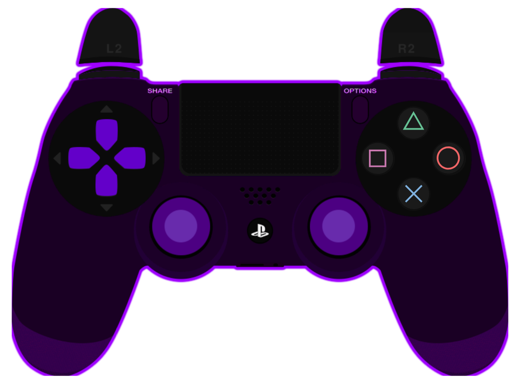

# Purple Gamepad-Viewer PS4 Controller # 

A custom PS4 controller to show inputs in real-time for [VysualsTv](https://www.twitch.tv/vysualstv)  
  

# How to use #
All you have to do is open the *Gamepad Viewer* link in your browser when your PS4 controller is connected. Now you can
include the browser window with OBS to display your inputs in real-time.

Link to the controller:  
https://gamepadviewer.com/?p=1&s=5&editcss=https%3A%2F%2Fschoettner.github.io%2Fedit.css

You have to use [Github.io](github.io) to publish your image and css files. Raw git or gist do not work anymore for
all git accounts.

# Notes #
- special thanks to jayraydee from the gamepad viewer discord server for the support with the github issue
- the skins were re-colored by vysualstv, not by me

# References #
[Gamepad Viewer](https://gamepadviewer.com/)  
[Example Style Sheet](https://gist.github.com/mrmcpowned/a787fc4f5307b7c008fb#file-edit-example-css)  
[Example Edit css](https://gist.github.com/mrmcpowned/2d4d29bd186c75b35c4da3f410f8690f)  
[Default css](https://gamepadviewer.com/style.css)  

